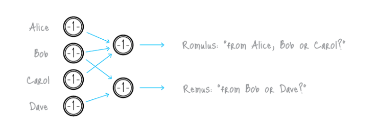
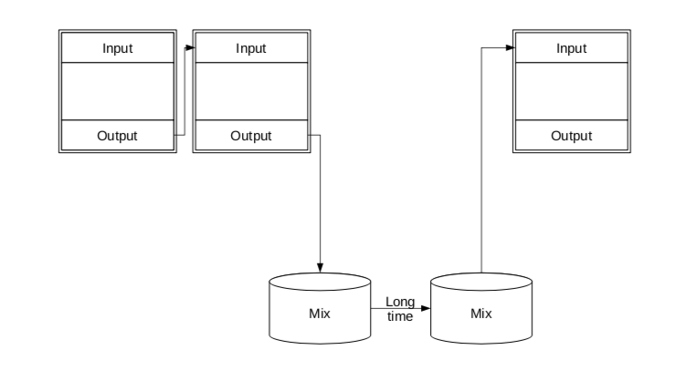
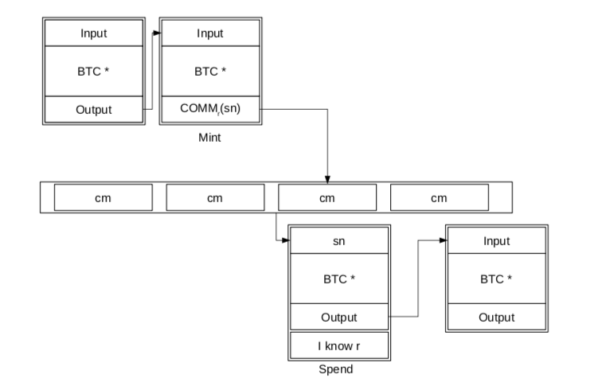
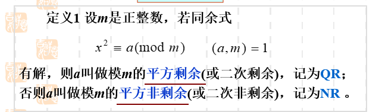
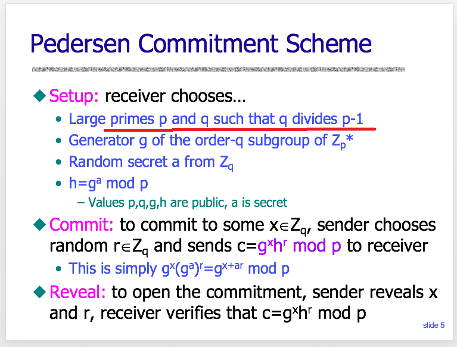
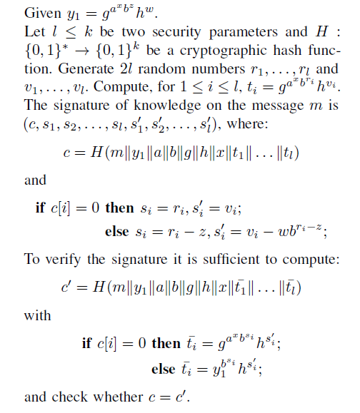
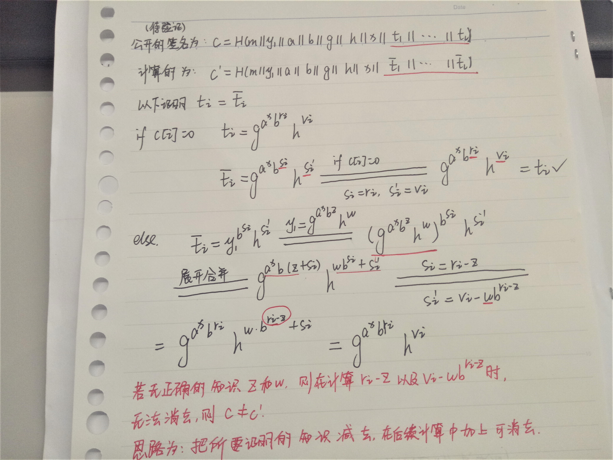

# Zerocoin

[TOC]

## 一、背景介绍

### 匿名性背景知识

**Anonymous** 是指：**unlinkable**，在Zerocoin中的描述是：“break the link between individual Bitcoin transactions”，就是无法确定谁给谁转了钱，即交易中的 from 和to 的对应关系被打破。

**门罗币（Monero）** 是通过 **环签名（ring signature）** 对输入地址进行隐藏来达到匿名性，在发起交易时，可以选择隐私等级(privacy levle)，即环签名中成员的数量。成员数量越多，隐匿程度越好，但是交易费越⾼，因为交易费与交易数据⼤⼩相关。

中心化的 **混合（MIX）** 机构：

Mix是放进去尽量多的交易，根据交易数额打乱 from 和 to 的关系。首先他是第三方中心化的可能不太安全，其次他要收手续费。

**Zerocoin**的总览图：

下面是Zerocoin的一段原文：比较抽象地说明在BTC基础上怎么扩展实现Zerocoin协议。

The existing  script language cannot be used for sophisticated calculations such as verifying zero-knowledge proofs.

Fortunately for our purposes, the Bitcoin designers chose to reserve several script operations for future expansion. 

We extend Bitcoin by adding a new instruction: **ZERO-COIN_MINT**.

+ Minting a zerocoin constructs a transaction with an output whose scriptPubKey contains this instruction and a coin c. Nodes who receive this transaction should validate that $c$ is a well-formed coin.

To spend a zerocoin, Alice constructs a new transaction that claims as input some Zerocoin mint transaction and has a scriptSig field containing $ (\pi; S) $ and a reference to the block containing the accumulator used in $\pi$ .【paper中第7页】

### 本文方案的简介

由浅入深逐渐对方案进行简单讲解：

简单的说，本论文的方案思路为： 假设此交易的场景为 Alice 要匿名给 Bob 要转 1btc：

- Alice 首先将要转账的 1 btc 通过某个交易按一定的比例转换为 zerocoin，【具体的兑换比例，文章中没有说到】新产生的 zerocoin 假设为 $c$，此交易称为 **mint transaction**。
- Alice 发起一笔交易将 $c$ 转给 Bob， 此交易称为 **spend transaction**。

为方便后文理解，先看一下论文中对方案的概述：

**$mint\ transaction$:**

- To mint a zerocoin of fixed denomination \$1 , 

  a user Alice first generates a random coin serial number $S$ .

  【选择 $S$ 时，不可与之前出现过的 $S$ 重复，在后文中会提到 $S$ 是用来防双花】

- Then commits to $S$ using a secure digital commitment scheme.

  The resulting commitment is a coin, denoted $c$, which can only be opened by a random number  $r$  to reveal the serial number $S$.【 $c$ 的值与 $S $ 和 $r$ 有关， $r$  即是本方案中 Alice 的知识，之后在花费 $c$ 时，$S$ 直接公开，以零知识的方式证明自己有与 $S$ 和 $c$ 相对应的 $r$ .】

- Alice pins $c$ to the public **bulletin board**, along with $1 of physical currency.【bulletin board直译过来是公告栏的意思，后文中有说：blockchain acts as a trusted, append-only bulletin board】

  **小总结：在 mint transaction 阶段，首先生成一个系列号 $S$ ，选择一个随机数 $r$ ，生成对 $S$ 的commitment 为 $c$ ，将 $c$ 加到区块链上，区块链上存储的是所有人的 $c$ 的集合.**

**$spend\ transaction$:**

- Alice first scans the bulletin board to obtain the set of valid commitments $(c_1,c_2,...c_N)$ that have thus far been posted by all users in the system.
- She next produces a non-interactive zero-knowledge proof **$\pi$** for the following two statements:
  - she knows a $c \in (c_1, ..... ,c_N)$【此过程选择用 Accumulator 来提升效率】
  - she knows a hidden value $r$ such that the commitment $c$ opens to $S$.
- Alice 发起一笔 spend transaction containing $(S, \pi)$，其他用户对签名 $\pi$ 进行验证，并检查 $S$ 之前并没有在其他的 spend transaction中出现过【$S$ 来验证是否双花】，若通过验证 Alice 则可得到$1的使用权.

## 二、Accumulator

### 提出背景

It is difficult to efficiently prove that a commitment  $c$ is in the set $(c_1,c_2,...c_N)$ . The naive solution is to prove the disjunction $ (c = c_1) \bigvee (c = c_2) ... (c = c_N)$. Unfortunately such “OR proofs” have size $O(N)$,which renders them impractical for all but small values of $N$.

所以为了使得此过程更加高效，本文采用一个基于 RSA 的累加器。

### 算法过程

算法目的：有效的证明一个元素在某个集合中，为保证匿名性，别人只可验证元素是否在集合中，但不知道具体是哪个元素，即花掉的是一笔有效的交易 $C$，但无法确定是哪笔交易。

- $AccumSetup( \lambda ) \longrightarrow params$. 

  On input a security parameter, sample primes $p,q$ (with polynomial dependence on the security parameter );

  compute $N = p*q$, and sample a seed value $u \in QR_N$; u ≠ 1. Output $(N,u)$  as params.

  注：$QR_N$ :模 $N$ 的二次剩余的集合，

  根据下图的定义，在此处则表示：$x^2 = u(mod\  N)\  \    (u,N)=1$ 有解

  

- $Accumulate(params,C) \longrightarrow A$. 

  On input params $(N, u)$ and a set of prime numbers $C =\lbrace c_1,c_2,...c_n|c_i\in[\cal A,\cal B ]\rbrace$ compute the accumulator A as $u^{c_1c_2...c_n}\ mod\  N$.

  注：

  + 此处可以看到所有的 $c_i$ 都是质数，后面会有解释；
  + $[\cal A,\cal B ]$ : Where $\cal A$ and $\cal B$ can be chosen with arbitrary polynomial dependence
    on the security parameter , as long as $2 < \cal A$ and $\cal B < A^2$.”

- $GenWitness(params, v,C) \longrightarrow w$. 

  On input params $(N, u)$, a set of prime numbers $C$ as described above, and a value $ v\in C$, the witness $w$ is the accumulation of all the values in $C$ besides $v$, i.e., 

  $w = Accumulate(params; C\backslash\lbrace v \rbrace)=u^{c_1c_2...c_n\backslash\lbrace v \rbrace}\ mod\  N$

  注：此处要证明 $v$ 是集合 $C$ 中的一个元素

- $AccVerify(params, A, v, w) \longrightarrow$ $\lbrace 0,1 \rbrace$. 

   On input params $(N, u)$, an element $v$ , and witness $w$, 

   compute $A^{'}=w^v$ and output 1 if and only if $A^ {'}= A$, $v$ is prime, and $v\in[\cal A,\cal B ]\rbrace$ as defined previously.

## 三、Zerocoin算法过程

+ $Setup(1^{\lambda} )\longrightarrow params$:

  On input a security parameter, run AccumSetup ($1^\lambda$) to obtain the values $ (N, u)$. 

  Next generate primes p,q such that $p = 2^wq + 1$ for $w >=1$. 

  Select random generators $g, h$ such that $\cal G = <g> = <h>$and $\cal G$ is a subgroup of $Z_q^* $ 

  Output $params = (N, u, p, q, g, h)$. 

  注：下图是对 $p = 2^wq + 1$ 的解释：

  

+ $Mint(params)\longrightarrow (c,skc)$. 

  Select  $S, r \longleftarrow Z_q^* $ and compute $c\longleftarrow g^Sh^r (mod \  p)$ such that  $\lbrace c\  prime|c \in[\cal A,\cal B ]\rbrace$ and output (c, skc={S，r}). 

+ $Spend(params, c, skc,R,C)\longrightarrow (\pi,S)$. 

  $Compute\ A \longleftarrow Accumulate((N, u),C) $ and $w \longleftarrow GenWitness((N,u),c,C)$ 

  Output $(\pi, S) $ where $\pi$ comprises the following signature of knowledge: 

  $\pi = ZKSoK[R] \lbrace (c,w, r) : AccVerify((N, u), A, c,w) = 1    \bigwedge\  c=g^Sh^r \rbrace $ 

+ $Verify(params,\pi, S,R,C) \longrightarrow \lbrace0; 1\rbrace$.

   Given a proof $\pi$, a serial number $S$, and a set of coins $C$, 

​       first compute $A \longleftarrow Accumulate((N, u),C)$.

​       Next verify that $\pi$ is the aforementioned signature of knowledge on $R$ using the known public values.

​       If the proof verifies successfully, output 1, otherwise output 0.

​      注：生成 $\pi$ 的过程：【在此方案中，z和w是知识】（附录B）

验证的具体过程：

+ 在代码中的对应关系为：$y_1$ 关于 $c$ 的一个commitment；$z,$和 $r$ 对应 ;$x$ 和 $S$ 相对应
+ 所有隐藏的知识是  $z, w$ ，如果没有正确的知识，则在计算时，不能满足 $c=c^{'} $,具体计算过程。

## 个人总结

1.zerocoin 的匿名性是通过对 origin 隐藏来实现，具体来说，每次发起的交易无法得知具体是哪一个 $C$ 被花费，但是对金额和 destination 并没有隐藏，zerocash 在这方面有所改进，可以全部都隐藏；

2.在 zerocash 的白皮书中说：Zerocoin has no mechanism for one user to pay another one directly in “zerocoins.” 即 zerocoin 只是转账过程中中间的 “过度” ，zerocash对此也有改进，通过将币与地址相关联，即每个生成的 $C$ 都有与之相关联的一对公私钥和地址。

## 附录 

+ In cryptography, the security parameter is a variable that measures the input size of the computational problem.

- Accumulator：

  A cryptographic [accumulator](https://en.wikipedia.org/wiki/Accumulator_(cryptography)) is a one way membership function. It answers a query as to whether a potential candidate is a member of a set without revealing the individual members of the set.【来源：wiki】

  解决的问题是：在不暴露集合元素的情况下，判断一个元素是否属于此集合

- trapdoor:

  A trapdoor function is a function that is easy to compute in one direction, yet difficult to compute in the opposite direction (finding its inverse) without special information, called the "trapdoor".

  if f is a trapdoor function, then there exists some secret information y, such that given f(x) and y, it is easy to compute *x*.
