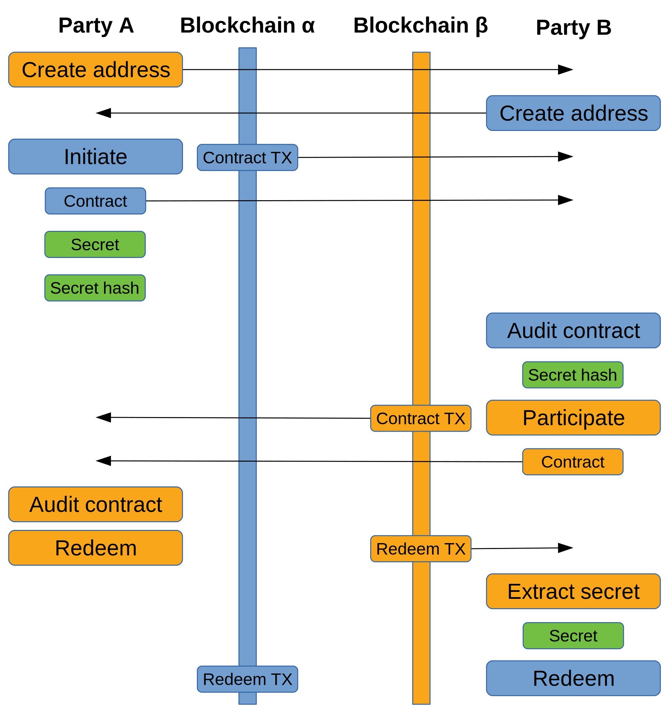
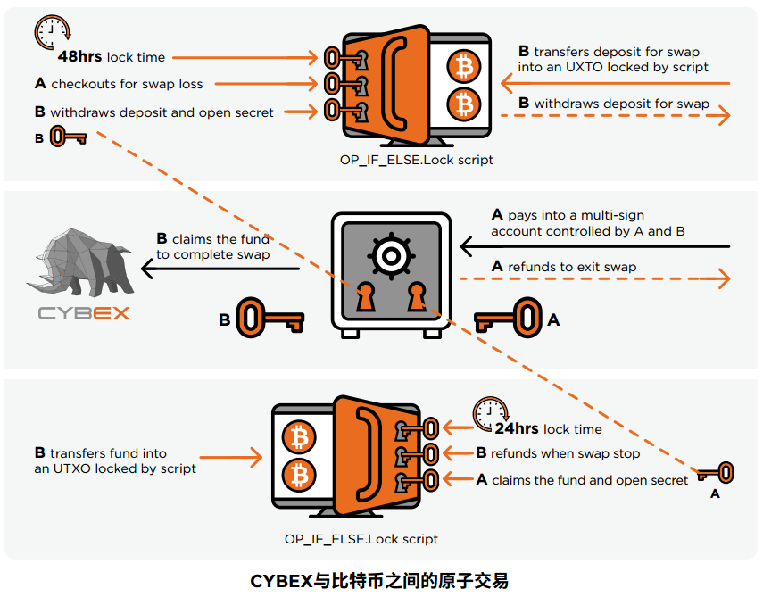
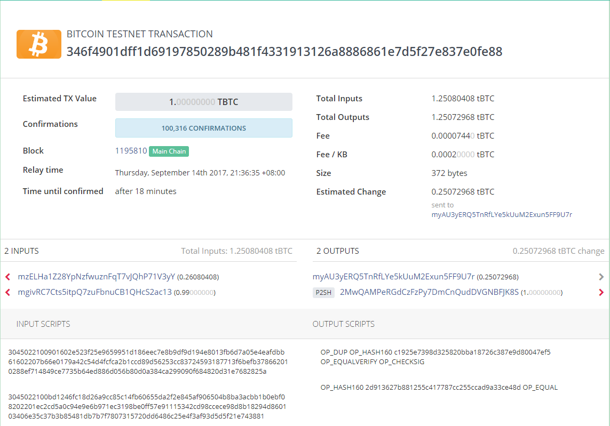
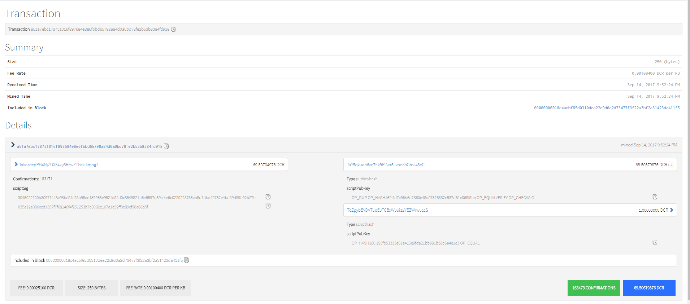
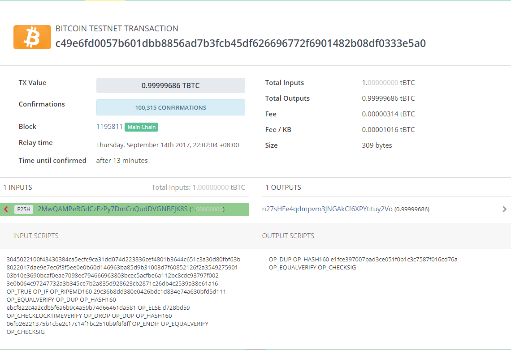
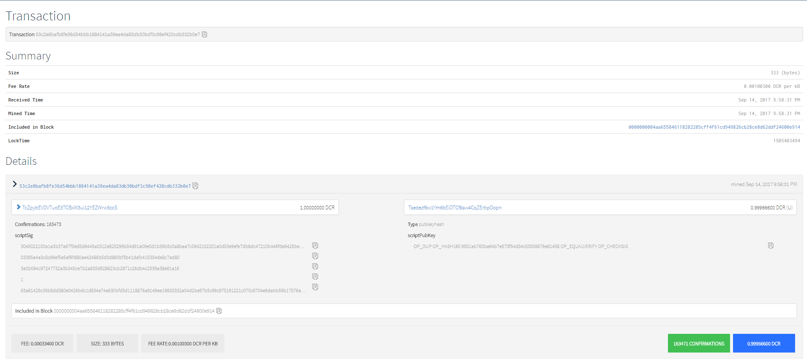

# atomic swap research

## 1. Concept

### Atomic - 原子性

In computer programming, atomic denotes a unitary action or object that is **indivisible, unchangeable, whole, and irreducible.** What this means is that either the trade will be completed in full or it will be canceled and both parties will get their coins back.

> "不成功便成仁".

### Atomic swap - 原子交换

Put simply, an atomic swap (also sometimes referred to as a **cross-chain swap or trade**) is a nearly **instantaneous exchange** of one cryptocurrency to another which *does not require a middleman or third party to oversee the transaction*.

> 去中心化, 无第三方的货币互换.

## 2. What’s the Current Status?
Since Charlie Lee’s announcement, there have been a few other coins which have announced that they too have completed successful atomic swaps between **Vertcoin** and **Komodo** and **Decred** to **Bitcoin**. Litecoin seems to be pushing the hardest out of all of the coins to adopt atomic swaps, *but for now the technology is still in its infancy*.

Right now one of the major drawbacks to the “average” user being able to complete atomic swaps currently **requires the users to have both networks completely synced**. In the case of larger blockchains such as Bitcoin, this is a big problem (Bitcoin’s blockchain is currently around 150 gigs, and growing daily).  The Komodo team has been attempting to solve this problem with the use of the Electrum server. This is could potentially allow users to interact with the blockchain without having to have download the entire chain.
 
That being said, most projects have been very closed-mouthed about when they actually foresee atomic swaps becoming commonplace. We’re just going to have to be patient for now.

But the future is bright for this technology with many exciting things to come. It is definitively something to keep your eyes on.


## 3. First Implementation - Decred
`Bitcoin based vs Bitcoin based`

> keywords: `P2SH` `script(OP_CODE)` `Lock time` `secret hash` `multi sig`

On September 20, 2017 **Decred** announced via Twitter that they had successfully completed an atomic swap between Decred and Litecoin. A few days later, Charlie Lee, CEO and founder of Litecoin, also announced via Twitter that the world’s first atomic swap had successfully been completed between **Bitcoin** and **Litecoin**. This caused a wave of excitement for the crypto community; many consider this an important milestone for bringing cryptocurrencies into the mainstream and predict that it will change the world of cryptocurrency forever.

* [github.com/decred/atomicswap](https://github.com/decred/atomicswap)

### process

The image below provides a visual of the steps each party performs and the
transfer of data between each party.



### action

```
Commands:
  initiate <participant address> <amount>
  participate <initiator address> <amount> <secret hash>
  redeem <contract> <contract transaction> <secret>
  refund <contract> <contract transaction>
  extractsecret <redemption transaction> <secret hash>
  auditcontract <contract> <contract transaction>
```

### action detail

**`initiate <participant address> <amount>`**

The `initiate` command is performed by the initiator to create the first
contract.  The contract is created with a **locktime of 48 hours** in the future.
This command **returns the secret, the secret hash, the contract script, the
contract transaction, and a refund transaction** that can be sent after 48 hours
if necessary.

Running this command will prompt for whether to publish the contract
transaction.  If everything looks correct, the transaction should be published.
The refund transaction should be saved in case a refund is required to be made
later.

For dcratomicswap, this step prompts for the wallet passphrase.  For the
btcatomicswap and ltcatomicswap tools the wallet must already be unlocked.

**`participate <initiator address> <amount> <secret hash>`**

The `participate` command is performed by the participant to create a contract
on the second blockchain.  It operates similarly to `initiate` but requires
using the secret hash from the initiator's contract and creates the contract
with a locktime of 24 hours.

Running this command will prompt for whether to publish the contract
transaction.  If everything looks correct, the transaction should be published.
The refund transaction should be saved in case a refund is required to be made
later.

For dcratomicswap, this step prompts for the wallet passphrase.  For the
btcatomicswap and ltcatomicswap tools the wallet must already be unlocked.

**`redeem <contract> <contract transaction> <secret>`**

The `redeem` command is performed by both parties to redeem coins paid into the
contract created by the other party.  Redeeming requires the secret and must be
performed by the initiator first.  Once the initiator's redemption has been
published, the secret may be extracted from the transaction and the participant
may also redeem their coins.

Running this command will prompt for whether to publish the redemption
transaction. If everything looks correct, the transaction should be published.

For dcratomicswap, this step prompts for the wallet passphrase.  For the
btcatomicswap and ltcatomicswap tools the wallet must already be unlocked.

**`refund <contract> <contract transaction>`**

The `refund` command is used to create and send a refund of a contract
transaction.  While the refund transaction is created and displayed during
contract creation in the initiate and participate steps, the refund can also be
created after the fact in case there was any issue sending the transaction (e.g.
the contract transaction was malleated or the refund fee is now too low).

Running this command will prompt for whether to publish the redemption
transaction. If everything looks correct, the transaction should be published.

**`extractsecret <redemption transaction> <secret hash>`**

The `extractsecret` command is used by the participant to extract the secret
from the initiator's redemption transaction.  With the secret known, the
participant may claim the coins paid into the initiator's contract.

The secret hash is a required parameter so that "nonstandard" redemption
transactions won't confuse the tool and the secret can still be discovered.

**`auditcontract <contract> <contract transaction>`**

The `auditcontract` command inspects a contract script and parses out the
addresses that may claim the output, the locktime, and the secret hash.  It also
validates that the contract transaction pays to the contract and reports the
contract output amount.  Each party should audit the contract provided by the
other to verify that their address is the recipient address, the output value is
correct, and that the locktime is sensible.

### Example

##### 1. **Alice: create contract**
<!-- > **Alice create contract** -->
>
> @input:
> * Bob's address (Bitcoin)
> * amount (Bitcoin)
>
> @return:
> * secret
> * secret hash
> * contract script
> * contract transaction
> * refund transaction
>  
> @public:
> * contract transaction
>
> @send:
> * secret hash
> * contract script
> * contract transaction

##### 2. **Bob: Audit the contract**

> @input:
> * contract
> * contract transaction
>
> @return:
> * Contract address:        2MwQAMPeRGdCzFzPy7DmCnQudDVGNBFJK8S
> * Contract value:          1 BTC
> * Recipient address:       n31og5QGuS28dmHpDH6PQD5wmVQ2K2spAG
> * Author's refund address: mg9sDLhfByfAWFo4zq3JZ7nsLfsN59XPue
> * Secret hash:             29c36b8dd380e0426bdc1d834e74a630bfd5d111
> * Locktime:                2017-09-16 13:36:23 +0000 UTC
> * Locktime reached in **47h56m54s**

check everything.

##### 3. **Bob: Create contract**

> @input:
> * Alice's address (Decred)
> * amount (Decred)
> * **secret hash** (from Alice)
>
> @return:
> * ~~secret~~
> * ~~secret hash~~
> * contract script
> * contract transaction
> * refund transaction
>  
> @public:
> * contract transaction
>
> @send:
> * ~~secret hash~~
> * contract script
> * contract transaction

##### 4. **Alice: Audit the contract**

> @input:
> * contract
> * contract transaction
>
> @return:
> * Contract address:        TcZpybEVDVTuoE3TCBxW3ui12YEZWrw5ccS
> * Contract value:          1 DCR
> * Recipient address:       TsfWDVTAcsLaHUhHnLLKkGnZuJz2vkmM6Vr
> * Author's refund address: Tsh9c9aytRaDcbLLxDRcQDRx66aXATh28R3
> * Secret hash: 29c36b8dd380e0426bdc1d834e74a630bfd5d111
> * Locktime: 2017-09-15 13:51:34 +0000 UTC
> * Locktime reached in **23h58m10s**

check everything. same as step #2

##### 5. **Alice: Redeem the contract**

> @input:
> * contract script (Decred)
> * contract transaction (Decred)
> * **secret**
> * **sig**
>
> @return:
> * redeem script **(with secret)**
> * redeem transaction
>  
> @public:
> * redeem transaction

##### 6. **Bob: Extract the secret**
B may watch a block explorer to see when the Decred contract output was spent and look up the
redeeming transaction.

-. -!

> @input:
> * redeem transaction (Decred)
>
> @return:
> * **secret**

##### 7. **Bob: Redeem the contract**

> @input:
> * contract script (Bitcon)
> * contract transaction (Bitcon)
> * **secret**
> * **sig**
>
> @return:
> * redeem script
> * redeem transaction
>  
> @public:
> * redeem transaction

##### 8. DONE

## 4. Another Implementation - Komodo
* [https://komodoplatform.com/](https://komodoplatform.com/)
* [komodo white paper](https://komodoplatform.com/wp-content/uploads/2018/04/2018-04-04-Komodo-White-Paper-Full.pdf)
## 5. Another Another Implementation - Cybex
由于 CYBEX 不具备类似于比特币的脚本系统，因此，我们使用了**多重签名账户**来锁定发起人向参
与者支付的 CYB（假设发起人支付 CYB），并使用脚本来锁定 UTXO 中参与者支付给发起人的比特币。
但多重签名方法的一个缺点就是**无法实现复原与退款过程的**。 CYBEX 设定了**保证金**要求来激励
并保障交易的完整性，从而解决了这一问题。

`Bitcoin based vs Bitshare based`



> keywords: `vesting balance` `multiple signature` `hash lock` `deposit` `cut and choose`

## 5. Ethereum
smart contract...

## 6. TX inspect

| Description | Transaction |
| - | - |
| Bitcoin contract created by A | [346f4901dff1d69197850289b481f4331913126a8886861e7d5f27e837e0fe88](https://www.blocktrail.com/tBTC/tx/346f4901dff1d69197850289b481f4331913126a8886861e7d5f27e837e0fe88) |
| Decred contract created by B | [a51a7ebc178731016f897684e8e6fbbd65798a84d0a0bd78fe2b53b8384fd918](https://testnet.decred.org/tx/a51a7ebc178731016f897684e8e6fbbd65798a84d0a0bd78fe2b53b8384fd918) |
| A's Decred redemption | [53c2e8bafb8fe36d54bbb1884141a39ea4da83db30bdf3c98ef420cdb332b0e7](https://testnet.decred.org/tx/53c2e8bafb8fe36d54bbb1884141a39ea4da83db30bdf3c98ef420cdb332b0e7) |
| B's Bitcoin redemption | [c49e6fd0057b601dbb8856ad7b3fcb45df626696772f6901482b08df0333e5a0](https://www.blocktrail.com/tBTC/tx/c49e6fd0057b601dbb8856ad7b3fcb45df626696772f6901482b08df0333e5a0) |

`1. Alice's contract on bitcoin`

[](https://www.blocktrail.com/tBTC/tx/346f4901dff1d69197850289b481f4331913126a8886861e7d5f27e837e0fe88)<br/><br/>

`P2PKH`

> `OP_DUP` `OP_HASH160` c1925e7398d325820bba18726c387e9d80047ef5 `OP_EQUALVERIFY` `OP_CHECKSIG`

`P2SH`

> `OP_HASH160` 2d913627b881255c417787cc255ccad9a33ce48d `OP_EQUAL`

`2. Bob's contract on decred`

[](https://testnet.decred.org/tx/a51a7ebc178731016f897684e8e6fbbd65798a84d0a0bd78fe2b53b8384fd918)<br/><br/>

> `OP_DUP` `OP_HASH160` 4d7c96b6d2360e48a07528332e537d81e068f8ba `OP_EQUALVERIFY` `OP_CHECKSIG`

> `OP_HASH160` 195fb53333e61a415e9fda21bb991b38b5a4e1c3 `OP_EQUAL`

`3. Bob's redeem on bitcoin`

[](https://www.blocktrail.com/tBTC/tx/c49e6fd0057b601dbb8856ad7b3fcb45df626696772f6901482b08df0333e5a0)<br/><br/>

redeem script

> `<sig>` `<PK>` `<secret>` `<T/F>` `{script}`

> 3045022100f43430384ca5ecfc9ca31dd074d223836cef4801b3644c651c3a30d80fbf63b8022017dae9e7ec6f3f5ee0e0b60d146963ba85d9b31003d7f60852126f2a3549275901

> 03b10e3690bcaf0eae7098ec794666963803bcec5acfbe6a112bc8cdc93797f002

> 3e0b064c97247732a3b345ce7b2a835d928623cb2871c26db4c2539a38e61a16

> `OP_TRUE`

> (scirpt starts here)

> `OP_IF` `OP_RIPEMD160` 29c36b8dd380e0426bdc1d834e74a630bfd5d111 `OP_EQUALVERIFY` `OP_DUP` `OP_HASH160` ebcf822c4a2cdb5f6a6b9c4a59b74d66461da581

> `OP_ELSE` d728bd59 `OP_CHECKLOCKTIMEVERIFY` `OP_DROP` `OP_DUP` `OP_HASH160` 06fb26221375b1cbe2c17c14f1bc2510b9f8f8ff

> `OP_ENDIF`

> `OP_EQUALVERIFY` `OP_CHECKSIG`

`4. Alice's redeem tx on decred`

[](https://testnet.decred.org/tx/53c2e8bafb8fe36d54bbb1884141a39ea4da83db30bdf3c98ef420cdb332b0e7)<br/><br/>

# FYI

### [Atomic swap - wikipedia](https://en.wikipedia.org/wiki/Atomic_swap)

An atomic swap is a proposed feature in cryptocurrencies, that allows for the exchange of one cryptocurrency for another cryptocurrency without the need for a trusted third party. In traditional cryptocurrencies a trusted third party such as an cryptocurrency exchange is necessary to perform a swap of cryptocurrencies in order to prevent one party from sending a currency without receiving a currency in return.

An atomic swap system uses a hash time-locked smart contract so that a party must deliver the currency to be swapped within a specified time, or else the transaction will be cancelled. This preserves atomicity in that either the swap will take place, or no currency will be swapped.

### [Atomic cross-chain trading - bitcoin wiki](https://en.bitcoin.it/wiki/Atomic_cross-chain_trading)

The problem of atomic cross-chain trading is one where (at least) two parties, Alice and Bob, own coins in separate cryptocurrencies, and want to exchange them without having to trust a third party (centralized exchange).

A non-atomic trivial solution would have Alice send her Bitcoins to Bob, and then have Bob send another cryptocurrency to Alice - but Bob has the option of going back on his end of the bargain and simply not following through with the protocol, ending up with both Bitcoins and the altcoin.

### [what-are-atomic-swaps](https://www.cryptocompare.com/coins/guides/what-are-atomic-swaps/)

### [why-atomic-swap-matters](https://www.investinblockchain.com/why-atomic-swap-matters/)

### [bitcoin script wiki(with OP CODE)](https://en.bitcoin.it/wiki/Script)

### [bitcoin developer index page](https://bitcoin.org/en/development)

### [bitcoin developer reference](https://bitcoin.org/en/developer-reference)

### [bitcoin lightning network](https://www.investinblockchain.com/lightning-network-bitcoin-scaling/)
