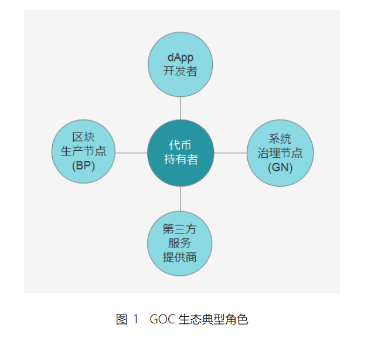
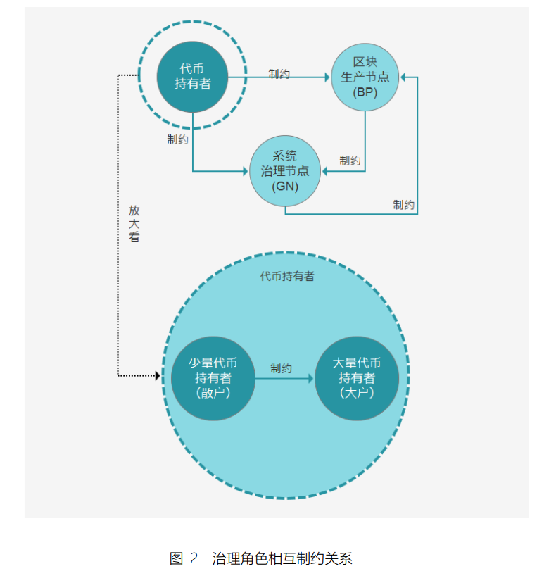
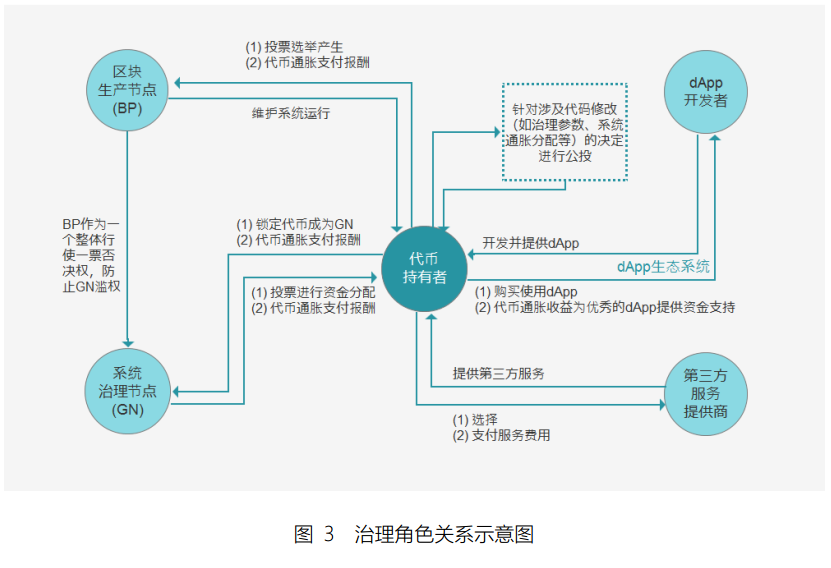
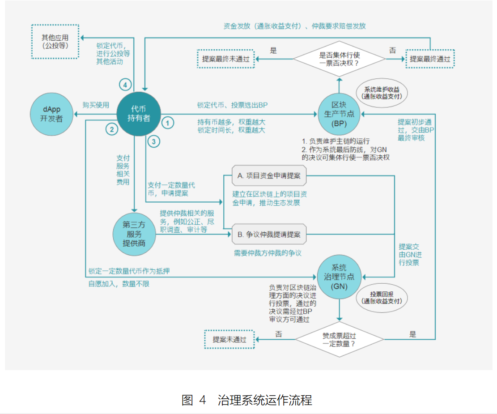
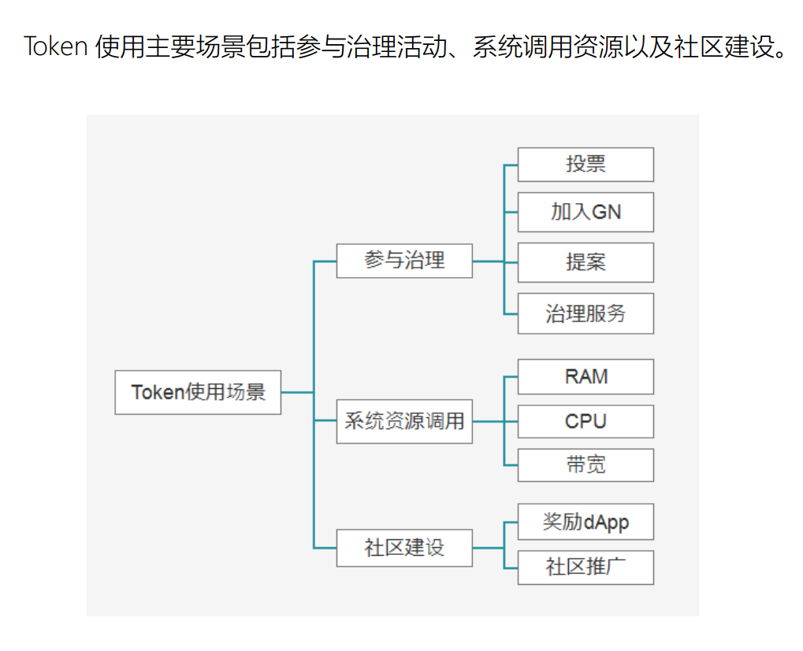

# GOC

_详细GOC的内容请翻阅GOC白皮书._

GOC 公链治理方面主要的参与角色包括： 代币持有者、 区块生产节点
（Block Producer， BP） 、 系统治理节点（Governance Node， GN） 、第
三方服务提供商、 dApp 开发者等。

角色

角色之间的制约关系

治理系统

Token

GOC 在其生态中增加了“系统治理节点”这个全新的角色，由这些“系统治
理节点”对系统上的治理问题进行决策，这样的设计意在将系统运行维护和系统
治理决策的职能分割开来，防止区块生产节点控制区块链的生态运行。

（1） 针对小部分持有大量代币的投资者掌握系统中大量权力的问题， GOC 设
计了以下机制予以解决。
 “系统治理节点”的是通过“一户一票”的形式进行投票的，按照人头而
不是按照持有代币的数量来投票是为了防止拥有大量代币的持币者控
制整个生态的治理决策权，这是目前区块链 0.3 公链的一个大问题。

 成为“系统治理节点”仅需要锁定一定数量的代币作为抵押，不存在投票
选举的机制，防止拥有大量代币的持币者通过策略性投票影响选举结
果，同时也鼓励更多愿意为公链生态献计献策的持币者加入到治理决
策中，分享治理决策带来的收益。
 GOC 中依然保留“区块生产节点”的角色，但是权力仅限于系统运行、
维护和升级的工作。
 区块生产节点通过持币者选举产生，持币者可以通过锁定一定数量的
代币来进行投票，投票的权重不再简单地和锁定的代币数量成线性关
系， GOC 的区块生产节点投票权重中投票代币的锁定时间也成为了决
定权重的重要变量：锁定时间越长，权重也越大，这是为了削弱拥有
大量代币但不为系统发展长远考虑的持有者的影响，增大长期持有者
决策权重而特意设计的。

（2） 针对生态中短期投资者过多，造成系统治理产生的不平衡或负反馈现象，
造成系统的“原住民”不断流失，新移民难以进入的现象（注 1）。 GOC 从参与
治理的模式到系统通证的分发设计了对应的方法，以解决上述问题。 :
 “系统治理节点“的门槛不高，大量拥有少量代币但拥有真知灼见的投资者
可以平等地参与生态的治理建设，保证了他们的话语权；
 “区块生产节点”的投票权重中加入了锁定时间这个变量也使长期投资
者的投票权重更大，使他们对系统的话语权更大。
 回归区块链项目发展的“初心”与“本源”， GOC 将不进行任何形式的募
资，链上的通证均按照社区成员为生态发展做出的贡献进行分发。
 系统初始生成的 50%通证的分发与使用，将完全置于链上进行，并由
全体治理节点与区块生产节点共同投票决策。

（3） GOC 的治理生态设计过程中十分注重不同角色之间权利的制衡问题，设
计了多重机制来防止某一方角色的权力泛滥问题。
 持币者通过锁定代币可以来为他们中意的区块生产节点投票，分享区
块生产产生的一定收益，代币一旦用于投票便不可再用于质押成为系
统治理节点，防止区块生产节点和系统治理节点的角色同时控制在部
分持币者手中。
 “系统治理节点”可以对提案进行投票决策，只有投票的“系统治理节点
才能够分享治理回报，鼓励更多人实实在在地参与到治理工作中，而
不是简单地占一个名额。
 “区块生产节点”对这些提案投票结果进行最终审核，虽然出于权力分离
的考虑将他们的治理决策权转移给了系统治理节点，但是他们仍然保
留”最后一道防线“的角色，对所有系统治理节点的提案投票结果可以行
使一票否决权，这使区块生产节点和系统治理节点的权力可以相互钳
制，不会产生节点控制生态的情况。
 所有和代码相关的决策，包括有关节点权利分配的参数，均需通过公
投来决定，将最终权力交还给代币持有人，防止节点“约束自己的规则
自己定”的情况出现。
 不同于目前区块链 0.3 项目中仲裁机构掌握争议决策权， GOC 将这个
权力交给了系统治理节点，系统治理节点从数量和参与方式上都更能
体现众多持币者的意志，这样是为了防止仲裁机构重新成为系统中中
心化的角色，还仲裁系统以“去中心化”的本质。

（4）GOC 充分而深刻地了解 dApp 生态对于公链长期发展的重要意义，因此，
GOC 设计了一系列鼓励资助 dApp 发展的机制，吸引更多的开发者加入到基于
GOC 系统的 dApp 开发中来。
 dApp开发者可以凭借其优秀的dApp项目通过提请项目资金申请提案
来获取开发资金；
 GOC 预留的代币将用于社区生态建设激励，其中包括通过资金资助来
鼓励更多的 dApp 开发者加入到 GOC 去中心化应用开发中。
GOC 希望通过上述机制能更有效地鼓励 GOC 链上的 dApp 生态的发展。
（5） GOC 公链的生态中还会出现众多第三方服务提供商，提供诸如公证、审
计、尽职调查、数据分析、系统监控等服务。
 第三方服务商可与服务于 GOC 生态的各个环节，例如争议仲裁过程中
可以有专门的第三方服务提供商提供咨询服务、证据采集服务、数据
分析服务以及仲裁意见服务，来帮助提请仲裁提案的争议双方以及负
责做出最终决定的系统治理节点更好地完成仲裁工作。
 第三方服务提供商将通过提供服务来获取报酬，同时，新兴的服务提
供商也可以通过提请项目资金申请提案来获取初始启动资金。当系统
中出现众多第三方服务提供商时，竞争机制和名誉机制将会鼓励优秀
的服务提供商并淘汰劣质的服务提供商，使整个生态更加健康.