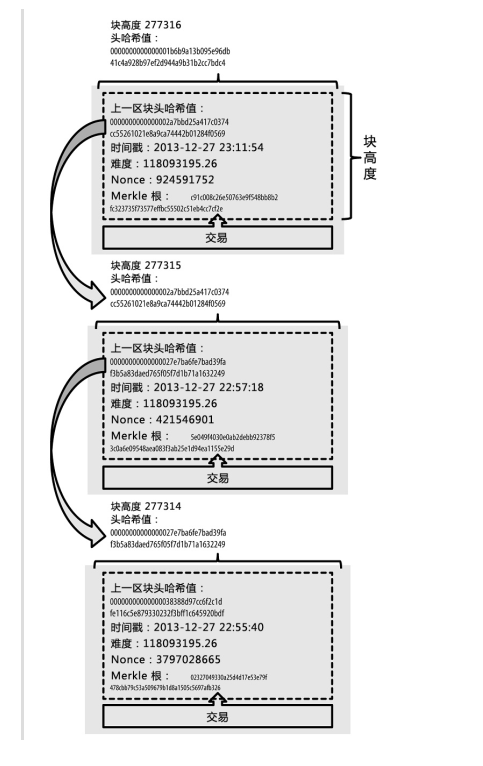
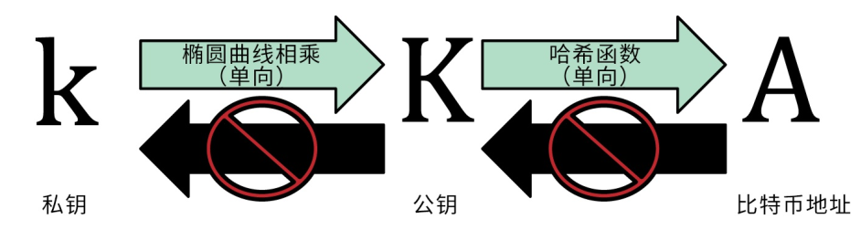
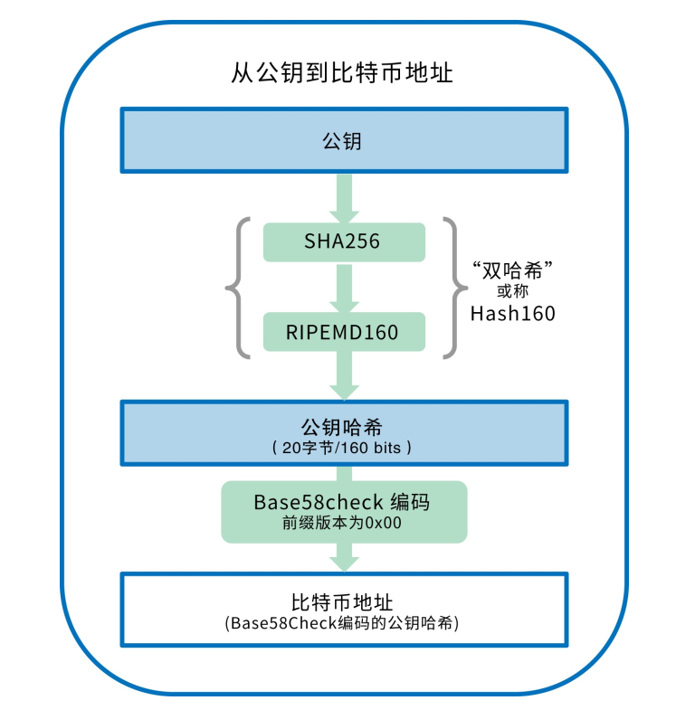
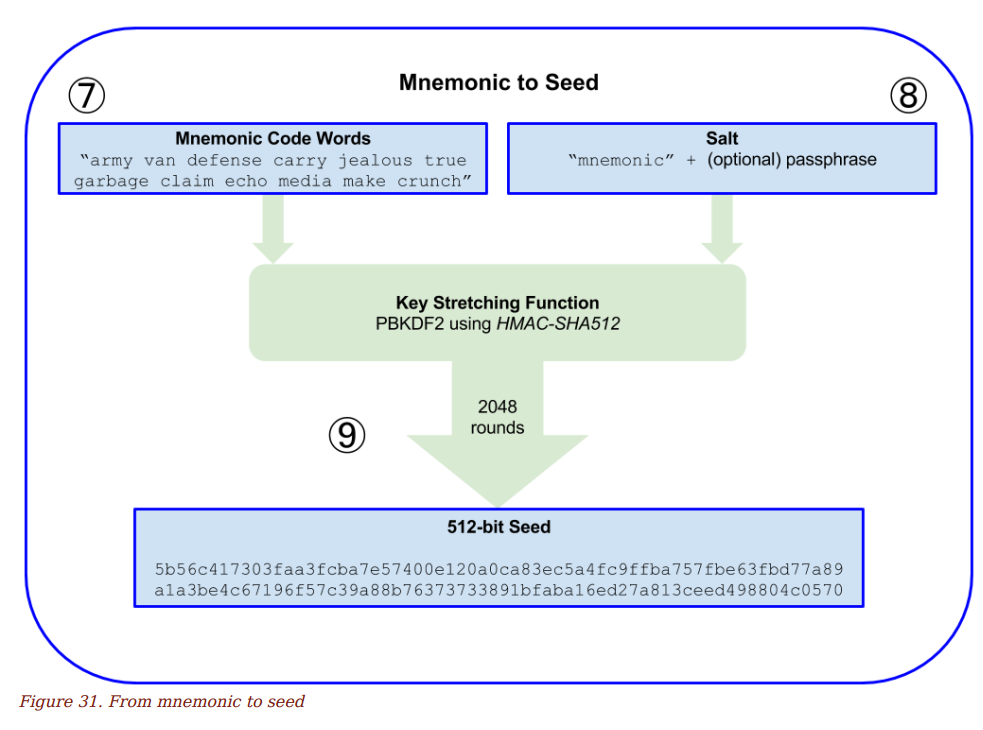
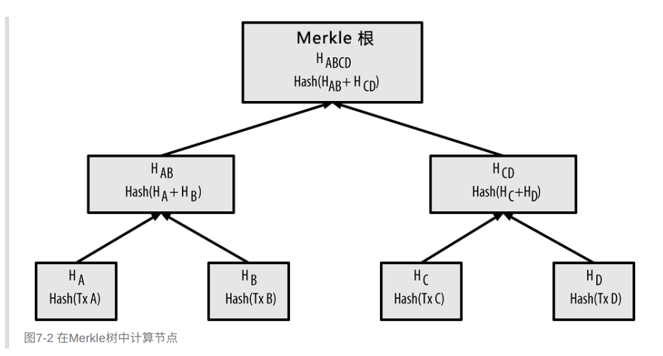
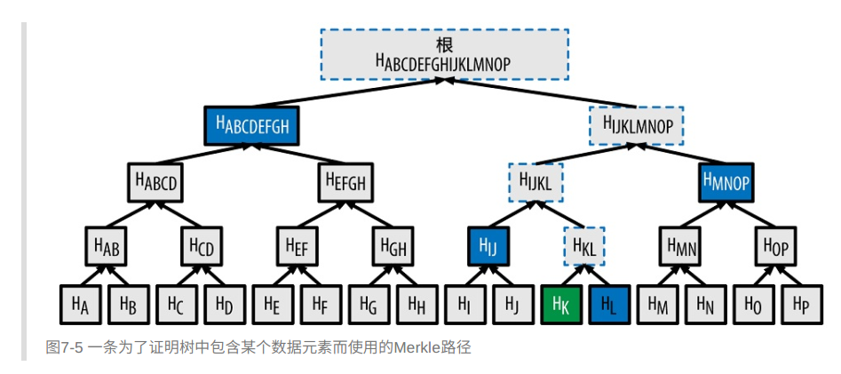
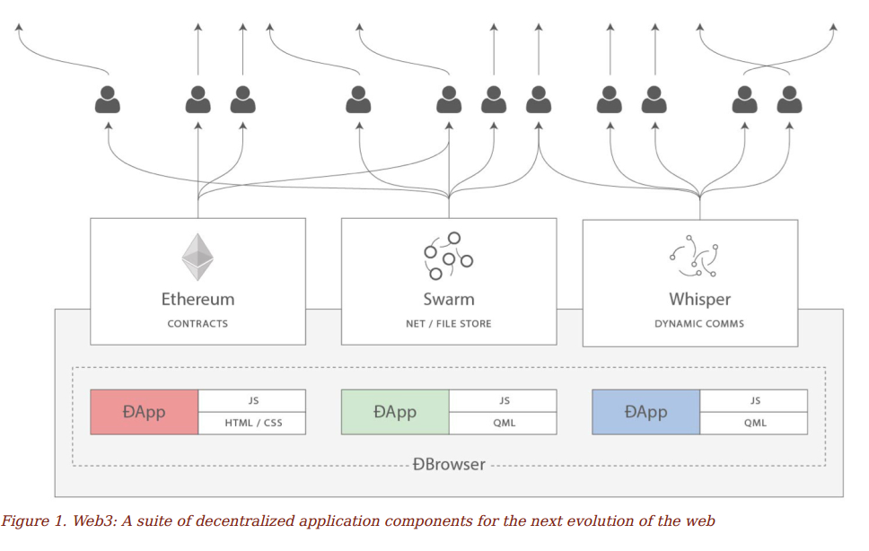
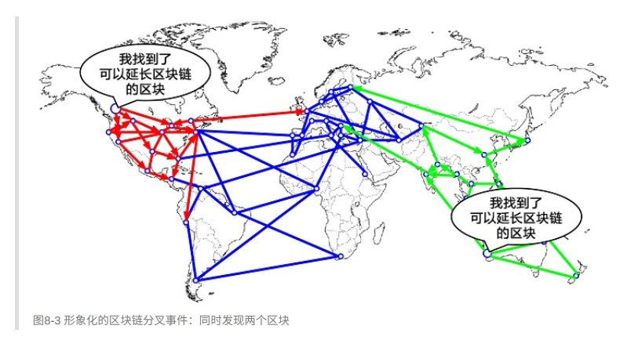

# EOS Intro

## Current Status

- 前世 = `BitShares` `Steem`
- Lisense = `MIT`
- Release = `1.3`
- Consensus = `DPOS`

### 基本的区块链特征

#### blockchain 1.0


- 区块链:
  
  每隔一定时间将所有交易(操作)打包为一个区块, 新区块中包含上一个区块的哈希, 保证不能被篡改

  - Mastering bitcoin:

    区块链是由包含交易信息的区块`从后向前有序链接起来`的数据结构。 它可以被存储为flat file（⼀种包含没有相对关系记录的
    ⽂件） ， 或是存储在⼀个简单`数据库`中。 ⽐特币核⼼客⼾端使⽤Google的`LevelDB数据库`存储区块链元数据。 区块被从后向
    前有序地链接在这个链条⾥， `每个区块都指向前⼀个区块`。 区块链经常被视为⼀个`垂直的栈`， 第⼀个区块作为栈底的⾸区
    块， 随后每个区块都被放置在其他区块之上。 ⽤栈来形象化表⽰区块依次堆叠这⼀概念后， 我们便可以使⽤⼀些术语， 例
    如： __“⾼度”来表⽰区块与⾸区块之间的距离__； 以及“顶部”或“顶端”来表⽰最新添加的区块。

  

- 密码学: 每个用户本质上是一个私钥, 私钥利用单向函数生成出公钥, 地址等. 私钥意味着一切
  
  

  

  - bitcoin:

    `secp256k1`

    `{K = k * G}`

    `A = RIPEMD160(SHA256(K))`

    k: 私钥, 256 bit 的数字

    K: 公钥, 椭圆曲线上的一个点(x, y)

    A: 地址, 公钥K可推导出A, 但A不可推出K, 单向

  - 助记词: 私钥太难记, 换成12个单词

  

  - 数字签名: 用私钥来对一段信息(或者交易)进行签名, 证明其正确性(Proof of Knowledge)

    Elliptic Curve Digital Signature Algorithm (ECDSA)
  
- 哈希:   满屏幕的哈希~~

  wiki hash定义: __"a hash function is any function that can be used to map data of arbitrary size to data of fixed size."__

  - The `Secure Hash Algorithms` are a family of cryptographic hash functions published by the National Institute of Standards and Technology (NIST) as a U.S. Federal Information Processing Standard (FIPS), including:

    - `SHA-0`: A retronym applied to the original version of the 160-bit hash function published in 1993 under the name "SHA". It was withdrawn shortly after publication due to an undisclosed "significant flaw" and replaced by the slightly revised version SHA-1.
    - `SHA-1`: A 160-bit hash function which resembles the earlier MD5 algorithm. This was designed by the National Security Agency (NSA) to be part of the Digital Signature Algorithm. Cryptographic weaknesses were discovered in SHA-1, and the standard was no longer approved for most cryptographic uses after 2010.
    - `SHA-2`: A family of two similar hash functions, with different block sizes, known as `SHA-256` and SHA-512. They differ in the word size; SHA-256 uses 32-bit words where SHA-512 uses 64-bit words. There are also truncated versions of each standard, known as SHA-224, SHA-384, SHA-512/224 and SHA-512/256. These were also designed by the NSA.
    - `SHA-3(Keccak-256)`: A hash function formerly called Keccak, chosen in 2012 after a public competition among non-NSA designers. It supports the same hash lengths as SHA-2, and its internal structure differs significantly from the rest of the SHA family.

  - 其他类型的哈希:

    - `md5` - 文件校验码

    - `奇偶校验码` - 可以看做最简单的哈希, 输出 1 bit

- 分布式: 整个区块链系统是一个庞大的分布式系统, 包含各种角色,如 用户, 全节点, 轻节点

  Peer to Peer(P2P)

  URL的一般语法格式为：
  
  protocol://hostname[:port]/path/[;parameters][?query]#fragment

  - file
  - http(s)
  - ftp
  - ed2k
  - thunder
  - ipfs

- 共识:   分布式系统中必备的数据一致性策略, bitcoin, ethereum为PoW, EOS为DPoS. Fabric中用到PBFT
  
  - 中本聪的主要发明就是这种__去中⼼化的⾃发共识机制__。 这种⾃发， 是指没有经过明确选举或者没有固定达成的共识的时间。
  换句话说， __共识是数以千计的独⽴节点遵守了简单的规则通过异步交互⾃发形成的产物__。 所有的⽐特币属性， 包括货币、 交
  易、 ⽀付以及不依靠中⼼机构和信任的安全模型等都是这个机制的衍⽣物。 ⽐特币的去中⼼化共识由所有⽹络节点的4种独⽴
  过程相互作⽤⽽产⽣：
    - 每个全节点依据综合标准对每个交易进⾏独⽴验证
    - 通过完成`⼯作量证明算法`的验算， 挖矿节点将交易记录独⽴打包进新区块，
    - 每个节点独⽴的对新区块进⾏`校验`并组装进区块链
    - 每个节点对区块链进⾏独⽴选择， 在⼯作量证明机制下选择累计⼯作量最⼤的区块链

  - Proof of Work (PoW)
  - Proof of Stake (PoS)
  - Proof of Authority (PoA)
  - Delegated Proof of Stake (DPoS) 

- 交易:   原文为transaction, 也可理解为事务. 区块中主要记录下来的内容
- Merkle: 一种哈希二叉树, 啊啊啊~哈希~. 用于快速验证交易的正确性

  

  

- 经济模型: 交易费, 矿工奖励, 用户奖励等等.

#### blockchain 2.0

- 智能合约: 
  - bitcoin的交易中会包含一个script, 由bitcoin定义的一个指令集中的各种指令构成, 用于验证交易的有效性
  - ethereum提出了smart contract的概念, 将区块链的功能从单纯的记录交易数据拓展出无限的可能

    "As we discovered in [intro], there are two different types of account in Ethereum: `Externally Owned Accounts (EOAs)`
    and `contract accounts`. EOAs are controlled by software, such as a wallet application, that is external to Ethereum.
    Contract accounts are controlled by software that runs within the `Ethereum Virtual Machine (EVM)`. Both types of
    accounts are identified by an Ethereum address. In this section, we will discuss the second type, contract accounts, and
    the software that controls them: smart contracts." - ehtereum book

    - Ethereum Virtual Machine

      智能合约执行环境

    - `smart contract`

      "The term `smart contract` has been used to describe a wide variety of different things. In the 1990’s, cryptographer Nick
      Szabo coined the term and defined it as __“a set of promises, specified in digital form, including protocols within which
      the parties perform on the other promises.”__ Since then, the concept of smart contracts has evolved, especially after the
      introduction of decentralized blockchains with the invention of Bitcoin in 2009. In this book, we use the term “smart
      contract” to refer to `immutable computer programs that run deterministically in the context of an Ethereum Virtual Machine`, 
      which operates as a `decentralized world computer`."

    - 比较经典的几个DApp:

      `crypto kitties` - 收集控

      `fomo3D` - 赌博控

    - 代币标准:

      [ERC20 Token Standard](https://github.com/ethereum/EIPs/blob/master/EIPS/eip-20.md)

      "The ERC20 standard defines a common interface for contracts implementing a token, such that any compatible token
      can be accessed and used in the same way. The interface consists of a number of functions that must be present in
      every implementation of the standard, as well as some optional functions and attributes that may be added by
      developers."

      Erc20 定义了一套代币合约的标准(接口规范)

      [ERC223]

        The ERC223 proposal attempts to solve the problem of inadvertent transfer of tokens to a contract (that may or may
        not support tokens) by detecting whether the destination address is a contract or not. 

      [ERC777]

      [ERC721 - non-fungible token (deed) standard]

        deed: A legal document that is signed and delivered, especially one regarding the ownership of property or legal rights.

    - ICO

      小康之路

- DAPP:
  
  Decentralized Applications

  基于智能合约, 可以进行各种去中心化的应用的开发, DAPP最主要的特点是所有敏感操作都记录在区块链上

  
  

#### 目前存在的一些问题

- 资源浪费.   PoW是公认的比较安全的共识机制, 但对电力的浪费十分恐怖, 不符合如今低碳环保的理念, 因此各种新的共识机制都在探究之中, 譬如 PoS, DPoS, BFT, PBFT
- 交易费用贵. 受PoW的影响, 矿工的挖矿成本变得很高, 因此矿工在打包交易的时候会去选择交易费用高的交易来打包, 这导致了费用太低的交易要在一两天后才被确认(ping: 24\*60\*60\*1000 ms~~)
- 交易速度慢. TPS(Transaction per Second)对于比特币来说, 只有2~3, __巨慢__, 以太坊也不是很高, 这一定程度上受PoW机制的影响. 另外由于一条记录一个区块的确认需要得到全网节点2/3的确认, 网络延迟和数据广播传递都制约了交易速度
- 存储量太大. 由于每个节点都要存储所有的区块链内容, 因此对每台机器的存储要求都很高, 16年bitcoin已经有大概160G的大小
- 黑客攻击.   因为太安全, 技术大佬们黑完之后安心跑路, 毫无后顾之忧
- 分叉.       "兄弟, 代码更新了你去重启下服务器"
  
  
  
### EOS

EOS基本上具有以上的特征, 并在此基础上针对一些缺陷进行了改进.

#### 特点

- `DPOS` Delegate Proof of Stake [link](https://medium.com/eosio/dpos-bft-pipelined-byzantine-fault-tolerance-8a0634a270ba)
  - 21个超级节点(Producer)
  - 低延迟, 0.5s 出一个块
  - 没有手续费.
  - 超级节点会有出块奖励
- 投票. 
  - EOS上的所有事情都可以通过投票来决定, 稳
  - 不可篡改 -> 投票篡改
  - 21个超级节点由用户投票(1EOS=1票)来产生
  - 代码更新, 投票
  - 出了大bug, 投票回滚
  - 被大佬黑掉了, 投票回滚
- 账户. 
  - 和ethereum类似, 增加了账户的概念, 并且可以用12个字符以内的文本来给账户起名字.
  - bitcoin中没有账户的概念
- 租赁模型
  - 开发DApp, 需要用到的网络和计算资源是按照开发者拥有的EOS的比例分配的.
  - EOS上只能合约的开发以及资源的使用, 相当于租赁, 用自己的EOS来抵押
  - 带宽和日志存储 (磁盘)
  - 计算与计算储备 (中央处理器)
  - 状态存储 (内存)
- WASM, 兼容EVM.

#### EOS 官方自吹

Some of the groundbreaking features of EOSIO include:

- Free Rate Limited Transactions
- Low Latency Block confirmation (0.5 seconds)
- Low-overhead Byzantine Fault Tolerant Finality
- Designed for optional high-overhead, low-latency BFT finality
- Smart contract platform powered by Web Assembly
- Designed for Sparse Header Light Client Validation
- Scheduled Recurring Transactions
- Time Delay Security
- Hierarchical Role Based Permissions
- Support for Biometric Hardware Secured Keys (e.g. Apple Secure Enclave)
- Designed for Parallel Execution of Context Free Validation Logic
- Designed for Inter Blockchain Communication

### EOSIO 软件介绍

EOSIO comes with a number of programs. The primary ones that you will use, and the ones that are covered here, are:

- `nodeos` (node + eos = nodeos) - the core EOSIO node daemon that can be configured with plugins to run a node. Example uses are block production, dedicated API endpoints, and local development.

- `cleos` (cli + eos = cleos) - command line interface to interact with the blockchain and to manage wallets

- `keosd` (key + eos = keosd) - component that securely stores EOSIO keys in wallets.

The basic relationship between these components is illustrated in the following diagram. 
In the sections that follow, you will build the EOSIO components, 
and deploy them in a single host, single node test network (testnet) configuration.


### Use Case

#### nodeos

nodeos 各种功能依赖于 `plugin`, 可在运行nodeos时设定是否开启某个plugin并给这个plugin设置参数

[plugin 详解](./plugin/plugin.md)

v1.3.0目前存在的 plugin

`bnet_plugin` block net, 同步区块的网络协议

`net_plugin`    基础网络协议
`net_api_plugin`基础网络api
`http_plugin`   http 网络协议
`http_client_plugin`http 客户端

`chain_plugin`
`chain_api_plugin`

`producer_plugin`
`producer_api_plugin`

`history_plugin`
`history_api_plugin`

`wallet_plugin`
`wallet_api_plugin`

`txn_test_gen_plugin`
`db_size_api_plugin`
`mongo_db_plugin`

`login_plugin`
`test_control_plugin`
`test_control_api_plugin`

nodeos 启动指令分析

```
$ nodeos
  --genesis-json  ./genesis.json    # 创世区块配置文件
  --blocks-dir    ./somenode/blocks # 区块数据存储位置
  --config-dir    ./somenode/       # 节点配置文件位置
  --data-dir      ./somenode/       # 节点数据存储位置
  --chain-state-db-size-mb  1024    # 最大缓存池大小
  --enable-stale-production         # 稳定出块???
  --max-transaction-time=1000       # 最大交易等待时间???
  --producer-name  somenode         # 昵称
  --signature-provider=EOS6N7FuKhCoEf2NUfsmZ5Gux4fNn2gMiroMNsR6tfgUT7VxNQEV3=KEY:5JSmNkiGSrsHsPVjoZYRR29GqFyhiaXrfD7pkzZoLoFjUKFccLv # 公私钥
  --verbose-http-errors             # http 报错打印详情
  --plugin eosio::http_plugin       # 开启 http_plugin
  --plugin eosio::chain_api_plugin  # 开启 chain_api_plugin
  --plugin eosio::producer_plugin   # 开启 producer_plugin
  --http-server-address     127.0.0.1:8000  # 本节点http服务监听端口
  --p2p-listen-endpoint     127.0.0.1:9000  # 本节点p2p服务监听端口
  --p2p-peer-address        127.0.0.1:9000  # peer 节点地址
  --p2p-peer-address        127.0.0.1:9001  # peer 节点地址
  --p2p-peer-address        127.0.0.1:9002  # peer 节点地址
  --p2p-peer-address        127.0.0.1:9003  # peer 节点地址(可以添加很多)
  --max-clients             19  
  --p2p-max-nodes-per-host  19
  --max-irreversible-block-age -1
  --contracts-console       # 合约执行结果打印到log中
  2>>./log.txt              # 所有打印结果放到log.txt中
```

```c
bnet_plugin
/**
 *  The purpose of this protocol is to synchronize (and keep synchronized) two
 *  blockchains using a very simple algorithm:
 *
 *  1. find the last block id on our local chain that the remote peer knows about
 *  2. if we have the next block send it to them
 *  3. if we don't have the next block send them a the oldest unexpired transaction
 *
 *  There are several input events:
 *
 *  1. new block accepted by local chain
 *  2. block deemed irreversible by local chain
 *  3. new block header accepted by local chain
 *  4. transaction accepted by local chain
 *  5. block received from remote peer
 *  6. transaction received from remote peer
 *  7. socket ready for next write
 *
 *  Each session is responsible for maintaining the following
 *
 *  1. the most recent block on our current best chain which we know
 *     with certainty that the remote peer has.
 *      - this could be the peers last irreversible block
 *      - a block ID after the LIB that the peer has notified us of
 *      - a block which we have sent to the remote peer
 *      - a block which the peer has sent us
 *  2. the block IDs we have received from the remote peer so that
 *     we can disconnect peer if one of those blocks is deemed invalid
 *      - we can clear these IDs once the block becomes reversible
 *  3. the transactions we have received from the remote peer so that
 *     we do not send them something that they already know.
 *       - this includes transactions sent as part of blocks
 *       - we clear this cache after we have applied a block that
 *         includes the transactions because we know the controller
 *         should not notify us again (they would be dupe)
 *
 *  Assumptions:
 *  1. all blocks we send the peer are valid and will be held in the
 *     peers fork database until they become irreversible or are replaced
 *     by an irreversible alternative.
 *  2. we don't care what fork the peer is on, so long as we know they have
 *     the block prior to the one we want to send. The peer will sort it out
 *     with its fork database and hopfully come to our conclusion.
 *  3. the peer will send us blocks on the same basis
 *
 */

net_plugin
net_api_plugin

http_plugin
http_client_plugin
/**
 * 开启各种http服务
 * 使得nodeos可通过http协议通信
 */


chain_plugin
/**
 * 和本地区块链数据各种交互的模块
 * 比如区块的增加读取, 公私钥操作
 */

chain_api_plugin
/**
 * 包含了如下的指令
 *   get_info
 *   get_block
 *   get_block_header_state
 *   get_account
 *   get_code
 *   get_code_hash
 *   get_abi
 *   get_raw_code_and_abi
 *   get_raw_abi
 *   get_table_rows
 *   get_table_by_scope
 *   get_currency_balance
 *   get_currency_stats
 *   get_producers
 *   get_producer_schedule
 *   get_scheduled_transactions
 *   abi_json_to_bin
 *   abi_bin_to_json
 *   get_required_keys
 *   get_transaction_id 
 *   push_block
 *   push_transaction
 *   push_transactions
 */


producer_plugin
/**
 * 开启producer的各种功能
 */


producer_api_plugin
/**
 * 和producer有关的api操作, 类似chain_api_plugin
 * 
 *    "**********SECURITY WARNING**********\n"
 *    "*                                  *\n"
 *    "* --        Producer API        -- *\n"
 *    "* - EXPOSED to the LOCAL NETWORK - *\n"
 *    "* - USE ONLY ON SECURE NETWORKS! - *\n"
 *    "*                                  *\n"
 *    "************************************\n"
 */

history_plugin
history_api_plugin
/**
 * action_history_index
 * account_history_index
 * 从chain.db中获取和action以及account有关的操作.
 * action就是transaction的意思.
 */


wallet_plugin
wallet_api_plugin
txn_test_gen_plugin
db_size_api_plugin
mongo_db_plugin
login_plugin
test_control_plugin
test_control_api_plugin
```

nodeos 帮助内容
```
$ nodeos -h
Application Options:

Config Options for eosio::bnet_plugin:
  --bnet-endpoint arg (=0.0.0.0:4321)   the endpoint upon which to listen for 
                                        incoming connections
  --bnet-follow-irreversible arg (=0)   this peer will request only 
                                        irreversible blocks from other nodes
  --bnet-threads arg                    the number of threads to use to process
                                        network messages
  --bnet-connect arg                    remote endpoint of other node to 
                                        connect to; Use multiple bnet-connect 
                                        options as needed to compose a network
  --bnet-no-trx                         this peer will request no pending 
                                        transactions from other nodes
  --bnet-peer-log-format arg (=["${_name}" ${_ip}:${_port}])
                                        The string used to format peers when 
                                        logging messages about them.  Variables
                                        are escaped with ${<variable name>}.
                                        Available Variables:
                                           _name  self-reported name
                                        
                                           _id    self-reported ID (Public Key)
                                        
                                           _ip    remote IP address of peer
                                        
                                           _port  remote port number of peer
                                        
                                           _lip   local IP address connected to
                                                  peer
                                        
                                           _lport local port number connected 
                                                  to peer
                                        
                                        

Config Options for eosio::chain_plugin:
  --blocks-dir arg (="blocks")          the location of the blocks directory 
                                        (absolute path or relative to 
                                        application data dir)
  --checkpoint arg                      Pairs of [BLOCK_NUM,BLOCK_ID] that 
                                        should be enforced as checkpoints.
  --wasm-runtime wavm/binaryen/wabt     Override default WASM runtime
  --abi-serializer-max-time-ms arg (=15000)
                                        Override default maximum ABI 
                                        serialization time allowed in ms
  --chain-state-db-size-mb arg (=1024)  Maximum size (in MiB) of the chain 
                                        state database
  --chain-state-db-guard-size-mb arg (=128)
                                        Safely shut down node when free space 
                                        remaining in the chain state database 
                                        drops below this size (in MiB).
  --reversible-blocks-db-size-mb arg (=340)
                                        Maximum size (in MiB) of the reversible
                                        blocks database
  --reversible-blocks-db-guard-size-mb arg (=2)
                                        Safely shut down node when free space 
                                        remaining in the reverseible blocks 
                                        database drops below this size (in 
                                        MiB).
  --contracts-console                   print contract's output to console
  --actor-whitelist arg                 Account added to actor whitelist (may 
                                        specify multiple times)
  --actor-blacklist arg                 Account added to actor blacklist (may 
                                        specify multiple times)
  --contract-whitelist arg              Contract account added to contract 
                                        whitelist (may specify multiple times)
  --contract-blacklist arg              Contract account added to contract 
                                        blacklist (may specify multiple times)
  --action-blacklist arg                Action (in the form code::action) added
                                        to action blacklist (may specify 
                                        multiple times)
  --key-blacklist arg                   Public key added to blacklist of keys 
                                        that should not be included in 
                                        authorities (may specify multiple 
                                        times)
  --read-mode arg (=speculative)        Database read mode ("speculative", 
                                        "head", or "read-only").
                                        In "speculative" mode database contains
                                        changes done up to the head block plus 
                                        changes made by transactions not yet 
                                        included to the blockchain.
                                        In "head" mode database contains 
                                        changes done up to the current head 
                                        block.
                                        In "read-only" mode database contains 
                                        incoming block changes but no 
                                        speculative transaction processing.
                                        
  --validation-mode arg (=full)         Chain validation mode ("full" or 
                                        "light").
                                        In "full" mode all incoming blocks will
                                        be fully validated.
                                        In "light" mode all incoming blocks 
                                        headers will be fully validated; 
                                        transactions in those validated blocks 
                                        will be trusted 
                                        
  --disable-ram-billing-notify-checks   Disable the check which subjectively 
                                        fails a transaction if a contract bills
                                        more RAM to another account within the 
                                        context of a notification handler (i.e.
                                        when the receiver is not the code of 
                                        the action).

Command Line Options for eosio::chain_plugin:
  --genesis-json arg                    File to read Genesis State from
  --genesis-timestamp arg               override the initial timestamp in the 
                                        Genesis State file
  --print-genesis-json                  extract genesis_state from blocks.log 
                                        as JSON, print to console, and exit
  --extract-genesis-json arg            extract genesis_state from blocks.log 
                                        as JSON, write into specified file, and
                                        exit
  --fix-reversible-blocks               recovers reversible block database if 
                                        that database is in a bad state
  --force-all-checks                    do not skip any checks that can be 
                                        skipped while replaying irreversible 
                                        blocks
  --disable-replay-opts                 disable optimizations that specifically
                                        target replay
  --replay-blockchain                   clear chain state database and replay 
                                        all blocks
  --hard-replay-blockchain              clear chain state database, recover as 
                                        many blocks as possible from the block 
                                        log, and then replay those blocks
  --delete-all-blocks                   clear chain state database and block 
                                        log
  --truncate-at-block arg (=0)          stop hard replay / block log recovery 
                                        at this block number (if set to 
                                        non-zero number)
  --import-reversible-blocks arg        replace reversible block database with 
                                        blocks imported from specified file and
                                        then exit
  --export-reversible-blocks arg        export reversible block database in 
                                        portable format into specified file and
                                        then exit
  --trusted-producer arg                Indicate a producer whose blocks 
                                        headers signed by it will be fully 
                                        validated, but transactions in those 
                                        validated blocks will be trusted.

Config Options for eosio::history_plugin:
  -f [ --filter-on ] arg                Track actions which match 
                                        receiver:action:actor. Actor may be 
                                        blank to include all. Action and Actor 
                                        both blank allows all from Recieiver. 
                                        Receiver may not be blank.
  -F [ --filter-out ] arg               Do not track actions which match 
                                        receiver:action:actor. Action and Actor
                                        both blank excludes all from Reciever. 
                                        Actor blank excludes all from 
                                        reciever:action. Receiver may not be 
                                        blank.

Config Options for eosio::http_client_plugin:
  --https-client-root-cert arg          PEM encoded trusted root certificate 
                                        (or path to file containing one) used 
                                        to validate any TLS connections made.  
                                        (may specify multiple times)
                                        
  --https-client-validate-peers arg (=1)
                                        true: validate that the peer 
                                        certificates are valid and trusted, 
                                        false: ignore cert errors

Config Options for eosio::http_plugin:
  --http-server-address arg (=127.0.0.1:8888)
                                        The local IP and port to listen for 
                                        incoming http connections; set blank to
                                        disable.
  --https-server-address arg            The local IP and port to listen for 
                                        incoming https connections; leave blank
                                        to disable.
  --https-certificate-chain-file arg    Filename with the certificate chain to 
                                        present on https connections. PEM 
                                        format. Required for https.
  --https-private-key-file arg          Filename with https private key in PEM 
                                        format. Required for https
  --access-control-allow-origin arg     Specify the Access-Control-Allow-Origin
                                        to be returned on each request.
  --access-control-allow-headers arg    Specify the Access-Control-Allow-Header
                                        s to be returned on each request.
  --access-control-max-age arg          Specify the Access-Control-Max-Age to 
                                        be returned on each request.
  --access-control-allow-credentials    Specify if Access-Control-Allow-Credent
                                        ials: true should be returned on each 
                                        request.
  --max-body-size arg (=1048576)        The maximum body size in bytes allowed 
                                        for incoming RPC requests
  --verbose-http-errors                 Append the error log to HTTP responses
  --http-validate-host arg (=1)         If set to false, then any incoming 
                                        "Host" header is considered valid
  --http-alias arg                      Additionaly acceptable values for the 
                                        "Host" header of incoming HTTP 
                                        requests, can be specified multiple 
                                        times.  Includes http/s_server_address 
                                        by default.

Config Options for eosio::login_plugin:
  --max-login-requests arg (=1000000)   The maximum number of pending login 
                                        requests
  --max-login-timeout arg (=60)         The maximum timeout for pending login 
                                        requests (in seconds)

Config Options for eosio::mongo_db_plugin:
  -q [ --mongodb-queue-size ] arg (=1024)
                                        The target queue size between nodeos 
                                        and MongoDB plugin thread.
  --mongodb-abi-cache-size arg (=2048)  The maximum size of the abi cache for 
                                        serializing data.
  --mongodb-wipe                        Required with --replay-blockchain, 
                                        --hard-replay-blockchain, or 
                                        --delete-all-blocks to wipe mongo 
                                        db.This option required to prevent 
                                        accidental wipe of mongo db.
  --mongodb-block-start arg (=0)        If specified then only abi data pushed 
                                        to mongodb until specified block is 
                                        reached.
  -m [ --mongodb-uri ] arg              MongoDB URI connection string, see: 
                                        https://docs.mongodb.com/master/referen
                                        ce/connection-string/. If not specified
                                        then plugin is disabled. Default 
                                        database 'EOS' is used if not specified
                                        in URI. Example: mongodb://127.0.0.1:27
                                        017/EOS
  --mongodb-store-blocks arg (=1)       Enables storing blocks in mongodb.
  --mongodb-store-block-states arg (=1) Enables storing block state in mongodb.
  --mongodb-store-transactions arg (=1) Enables storing transactions in 
                                        mongodb.
  --mongodb-store-transaction-traces arg (=1)
                                        Enables storing transaction traces in 
                                        mongodb.
  --mongodb-store-action-traces arg (=1)
                                        Enables storing action traces in 
                                        mongodb.
  --mongodb-filter-on arg               Track actions which match 
                                        receiver:action:actor. Receiver, 
                                        Action, & Actor may be blank to include
                                        all. i.e. eosio:: or :transfer:  Use * 
                                        or leave unspecified to include all.
  --mongodb-filter-out arg              Do not track actions which match 
                                        receiver:action:actor. Receiver, 
                                        Action, & Actor may be blank to exclude
                                        all.

Config Options for eosio::net_plugin:
  --p2p-listen-endpoint arg (=0.0.0.0:9876)
                                        The actual host:port used to listen for
                                        incoming p2p connections.
  --p2p-server-address arg              An externally accessible host:port for 
                                        identifying this node. Defaults to 
                                        p2p-listen-endpoint.
  --p2p-peer-address arg                The public endpoint of a peer node to 
                                        connect to. Use multiple 
                                        p2p-peer-address options as needed to 
                                        compose a network.
  --p2p-max-nodes-per-host arg (=1)     Maximum number of client nodes from any
                                        single IP address
  --agent-name arg (="EOS Test Agent")  The name supplied to identify this node
                                        amongst the peers.
  --allowed-connection arg (=any)       Can be 'any' or 'producers' or 
                                        'specified' or 'none'. If 'specified', 
                                        peer-key must be specified at least 
                                        once. If only 'producers', peer-key is 
                                        not required. 'producers' and 
                                        'specified' may be combined.
  --peer-key arg                        Optional public key of peer allowed to 
                                        connect.  May be used multiple times.
  --peer-private-key arg                Tuple of [PublicKey, WIF private key] 
                                        (may specify multiple times)
  --max-clients arg (=25)               Maximum number of clients from which 
                                        connections are accepted, use 0 for no 
                                        limit
  --connection-cleanup-period arg (=30) number of seconds to wait before 
                                        cleaning up dead connections
  --max-cleanup-time-msec arg (=10)     max connection cleanup time per cleanup
                                        call in millisec
  --network-version-match arg (=0)      True to require exact match of peer 
                                        network version.
  --sync-fetch-span arg (=100)          number of blocks to retrieve in a chunk
                                        from any individual peer during 
                                        synchronization
  --max-implicit-request arg (=1500)    maximum sizes of transaction or block 
                                        messages that are sent without first 
                                        sending a notice
  --use-socket-read-watermark arg (=0)  Enable expirimental socket read 
                                        watermark optimization
  --peer-log-format arg (=["${_name}" ${_ip}:${_port}])
                                        The string used to format peers when 
                                        logging messages about them.  Variables
                                        are escaped with ${<variable name>}.
                                        Available Variables:
                                           _name  self-reported name
                                        
                                           _id    self-reported ID (64 hex 
                                                  characters)
                                        
                                           _sid   first 8 characters of 
                                                  _peer.id
                                        
                                           _ip    remote IP address of peer
                                        
                                           _port  remote port number of peer
                                        
                                           _lip   local IP address connected to
                                                  peer
                                        
                                           _lport local port number connected 
                                                  to peer
                                        
                                        

Config Options for eosio::producer_plugin:

  -e [ --enable-stale-production ]      Enable block production, even if the 
                                        chain is stale.
  -x [ --pause-on-startup ]             Start this node in a state where 
                                        production is paused
  --max-transaction-time arg (=30)      Limits the maximum time (in 
                                        milliseconds) that is allowed a pushed 
                                        transaction's code to execute before 
                                        being considered invalid
  --max-irreversible-block-age arg (=-1)
                                        Limits the maximum age (in seconds) of 
                                        the DPOS Irreversible Block for a chain
                                        this node will produce blocks on (use 
                                        negative value to indicate unlimited)
  -p [ --producer-name ] arg            ID of producer controlled by this node 
                                        (e.g. inita; may specify multiple 
                                        times)
  --private-key arg                     (DEPRECATED - Use signature-provider 
                                        instead) Tuple of [public key, WIF 
                                        private key] (may specify multiple 
                                        times)
  --signature-provider arg (=GOC6MRyAjQq8ud7hVNYcfnVPJqcVpscN5So8BhtHuGYqET5GDW5CV=KEY:5KQwrPbwdL6PhXujxW37FSSQZ1JiwsST4cqQzDeyXtP79zkvFD3)
                                        Key=Value pairs in the form 
                                        <public-key>=<provider-spec>
                                        Where:
                                           <public-key>    is a string form of 
                                                           a vaild EOSIO public
                                                           key
                                        
                                           <provider-spec> is a string in the 
                                                           form <provider-type>
                                                           :<data>
                                        
                                           <provider-type> is KEY, or KEOSD
                                        
                                           KEY:<data>      is a string form of 
                                                           a valid EOSIO 
                                                           private key which 
                                                           maps to the provided
                                                           public key
                                        
                                           KEOSD:<data>    is the URL where 
                                                           keosd is available 
                                                           and the approptiate 
                                                           wallet(s) are 
                                                           unlocked
  --keosd-provider-timeout arg (=5)     Limits the maximum time (in 
                                        milliseconds) that is allowd for 
                                        sending blocks to a keosd provider for 
                                        signing
  --greylist-account arg                account that can not access to extended
                                        CPU/NET virtual resources
  --produce-time-offset-us arg (=0)     offset of non last block producing time
                                        in micro second. Negative number 
                                        results in blocks to go out sooner, and
                                        positive number results in blocks to go
                                        out later
  --last-block-time-offset-us arg (=0)  offset of last block producing time in 
                                        micro second. Negative number results 
                                        in blocks to go out sooner, and 
                                        positive number results in blocks to go
                                        out later
  --incoming-defer-ratio arg (=1)       ratio between incoming transations and 
                                        deferred transactions when both are 
                                        exhausted

Config Options for eosio::txn_test_gen_plugin:
  --txn-reference-block-lag arg (=0)    Lag in number of blocks from the head 
                                        block when selecting the reference 
                                        block for transactions (-1 means Last 
                                        Irreversible Block)

Application Config Options:
  --plugin arg                          Plugin(s) to enable, may be specified 
                                        multiple times

Application Command Line Options:
  -h [ --help ]                         Print this help message and exit.
  -v [ --version ]                      Print version information.
  --print-default-config                Print default configuration template
  -d [ --data-dir ] arg                 Directory containing program runtime 
                                        data
  --config-dir arg                      Directory containing configuration 
                                        files such as config.ini
  -c [ --config ] arg (=config.ini)     Configuration file name relative to 
                                        config-dir
  -l [ --logconf ] arg (=logging.json)  Logging configuration file name/path 
                                        for library users

```

#### keosd

The program `keosd`, located in the eos/build/programs/keosd folder within the EOSIO/eos repository, 
can be used to `store private keys` that cleos will use to sign transactions sent to the block chain. 
__keosd runs on your `local` machine and stores your private keys `locally`.__

```
$ keosd --help
Application Options:

Config Options for eosio::http_plugin:
  --http-server-address arg (=127.0.0.1:8888)
                                        The local IP and port to listen for
                                        incoming http connections; set blank to
                                        disable.
  --https-server-address arg            The local IP and port to listen for
                                        incoming https connections; leave blank
                                        to disable.
  --https-certificate-chain-file arg    Filename with the certificate chain to
                                        present on https connections. PEM
                                        format. Required for https.
  --https-private-key-file arg          Filename with https private key in PEM
                                        format. Required for https
  --access-control-allow-origin arg     Specify the Access-Control-Allow-Origin
                                        to be returned on each request.
  --access-control-allow-headers arg    Specify the Access-Control-Allow-Header
                                        s to be returned on each request.
  --access-control-allow-credentials    Specify if Access-Control-Allow-Credent
                                        ials: true should be returned on each
                                        request.

Config Options for eosio::wallet_plugin:
  --wallet-dir arg (=".")               The path of the wallet files (absolute
                                        path or relative to application data
                                        dir)
  --unlock-timeout arg (=900)           Timeout for unlocked wallet in seconds
                                        (default 900 (15 minutes)). Wallets
                                        will automatically lock after specified
                                        number of seconds of inactivity.
                                        Activity is defined as any wallet
                                        command e.g. list-wallets.
  --eosio-key arg                       eosio key that will be imported
                                        automatically when a wallet is created.

Application Config Options:
  --plugin arg                          Plugin(s) to enable, may be specified
                                        multiple times

Application Command Line Options:
  -h [ --help ]                         Print this help message and exit.
  -v [ --version ]                      Print version information.
  --print-default-config                Print default configuration template
  -d [ --data-dir ] arg                 Directory containing program runtime
                                        data
  --config-dir arg                      Directory containing configuration
                                        files such as config.ini
  -c [ --config ] arg (=config.ini)     Configuration file name relative to
                                        config-dir
  -l [ --logconf ] arg (=logging.json)  Logging configuration file name/path
                                        for library users
```

#### cleos

```
Command Line Interface to EOSIO Client
Usage: ./programs/cleos/cleos [OPTIONS] SUBCOMMAND

Options:
  -h,--help                   Print this help message and exit
  -u,--url TEXT=http://localhost:8888/
                              the http/https URL where nodeos is running
  --wallet-url TEXT=http://localhost:8900/
                              the http/https URL where keosd is running
  -r,--header                 pass specific HTTP header; repeat this option to pass multiple headers
  -n,--no-verify              don't verify peer certificate when using HTTPS
  -v,--verbose                output verbose actions on error

Subcommands:
  version                     Retrieve version information
  create                      Create various items, on and off the blockchain
  get                         Retrieve various items and information from the blockchain
  set                         Set or update blockchain state
  transfer                    Transfer EOS from account to account
  net                         Interact with local p2p network connections
  wallet                      Interact with local wallet
  sign                        Sign a transaction
  push                        Push arbitrary transactions to the blockchain
  multisig                    Multisig contract commands
  system                      Send eosio.system contract action to the blockchain.
```

### 传送门

- [eos.io 官网](https://eos.io/)
- [eos.io 开发者](https://developers.eos.io/)
- [eos github](https://github.com/EOSIO)
- [Blog](https://medium.com/eosio)
- [StackExchange for Q&A](https://eosio.stackexchange.com/)
- [Community Telegram Group](https://t.me/EOSProject)
- [Developer Telegram Group](https://t.me/joinchat/EaEnSUPktgfoI-XPfMYtcQ)
- [White Paper](https://github.com/EOSIO/Documentation/blob/master/TechnicalWhitePaper.md)
- [Roadmap](https://github.com/EOSIO/Documentation/blob/master/Roadmap.md)

## Release

### [V1.3.0](https://github.com/EOSIO/eos/releases/tag/v1.3.0)

- [info blog](https://medium.com/eosio/eosio-version-1-3-0-5c15dcfd79a2)

### [V1.2.0](https://github.com/EOSIO/eos/releases/tag/v1.2.0)

- [info blog](https://medium.com/eosio/eosio-version-1-2-0-e1972ddcf367)

